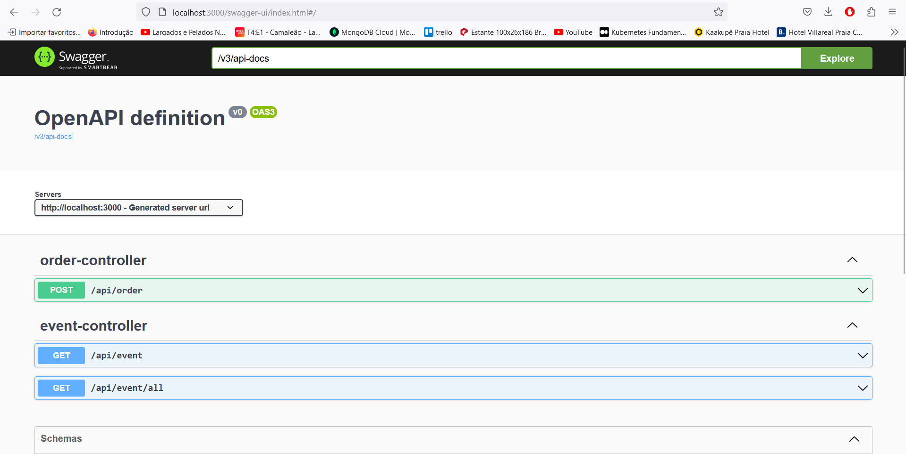

# Projeto: ms-order-pattern-saga-coreografado


O projeto é um sistema de microservices desenvolvido em Java com Spring Boot, com objetivo de gerir ordens de serviços e manipulação de estoque de forma distribuída. Uma abordagem central nesse projeto é a aplicação do ‘design’ pattern Saga e a utilização do Apache Kafka como meio de comunicação entre os microservices.
Nesse caso utilizando a saga `Coreografada` é uma forma de implementar transações distribuídas longas que abrangem múltiplos microservices.

Ao contrário da Saga Orquestrada, onde há um coordenador central que gerencia o fluxo, na Saga Coreografada cada serviço executa uma parte da transação e sabe exatamente o que o próximo serviço deve fazer.

O fluxo é coreografado, com cada serviço executando uma etapa e publicando um evento sobre o resultado dessa etapa. O próximo serviço assina esse evento e executa a próxima etapa.

Por exemplo, na compra de um produto:

O serviço de pagamento recebe a requisição, processa o pagamento e publica um evento "pagamento confirmado".
O serviço de estoque assina esse evento, verifica a disponibilidade do produto e publica um evento "reserva confirmada".
O serviço de entrega assina o evento "reserva confirmada" e agenda a entrega.
Cada serviço executa uma etapa e comunica o resultado via eventos assíncronos. Não há coordenador central.

**Arquitetura de Microservices:** O sistema é composto por vários microservices que desempenham funções específicas, como a criação de ordens de serviço, o processamento de pagamentos, a atualização do estoque e assim por diante. Cada microservice é responsável por uma parte do processo, permitindo escalabilidade e flexibilidade.

**‘Design’ Pattern Saga Coreografado:** O padrão Saga é aplicado para garantir a consistência e atomicidade das transações distribuídas. Quando uma ordem de serviço é criada, por exemplo, uma sequência de etapas é acionada, e em caso de erro em qualquer uma dessas etapas, é possível reverter ou compensar as ações já realizadas, mantendo o sistema num estado consistente.

**Kafka como Middleware:** O Apache Kafka é utilizado como um middleware de mensagens para facilitar a comunicação assíncrona entre os microservices. Ele permite que os eventos sejam publicados e consumidos de forma confiável, garantindo que as mensagens sejam entregues aos consumidores, mesmo em cenários de alta carga.

**Fluxo de Operações Típico:** Quando um cliente cria uma ordem de serviço, o microservice correspondente publica um evento no Kafka informando essa ação. Outros microservices, como o de pagamento e o de gestão de estoque, assinam esses eventos e realizam as suas operações específicas. Se algo der errado em qualquer etapa, o padrão Saga é acionado para garantir a consistência dos dados.

**Benefícios do Projeto:** O benefício é evitar o coordenador como gargalo e aumentar a disponibilidade. A desvantagem é que debugar e monitorar fluxos distribuídos é mais complexo.
A Saga Coreografada é útil para transações distribuídas em arquiteturas de microservices com comunicação assíncrona via mensageria.

Em resumo, representa uma implementação robusta e altamente técnica de um sistema de microservices para gestão de ordens de serviço e estoque, aplicando o ‘design’ pattern Saga e utilizando o Apache Kafka para comunicação assíncrona entre os serviços. Esse projeto é uma demonstração de boas práticas no desenvolvimento de sistemas distribuídos com Java e Spring Boot.

### Sumário:

* [Tecnologias](#tecnologias)
* [Ferramentas utilizadas](#ferramentas-utilizadas)
* [Arquitetura Proposta](#arquitetura-proposta)
* [Execução do projeto](#execu%C3%A7%C3%A3o-do-projeto)
    * [01 - Execução geral via docker-compose](#01---execu%C3%A7%C3%A3o-geral-via-docker-compose)
    * [02 - Execução geral via automação com script em Python](#02---execu%C3%A7%C3%A3o-geral-via-automa%C3%A7%C3%A3o-com-script-em-python)
    * [03 - Executando os serviços de bancos de dados e Message Broker](#03---executando-os-servi%C3%A7os-de-bancos-de-dados-e-message-broker)
    * [04 - Executando manualmente via CLI](#04---executando-manualmente-via-cli)
* [Acessando a aplicação](#acessando-a-aplica%C3%A7%C3%A3o)
* [Acessando tópicos com Redpanda Console](#acessando-t%C3%B3picos-com-redpanda-console)
* [Dados da API](#dados-da-api)
    * [Produtos registrados e seu estoque](#produtos-registrados-e-seu-estoque)
    * [Endpoint para iniciar a saga](#endpoint-para-iniciar-a-saga)
    * [Endpoint para visualizar a saga](#endpoint-para-visualizar-a-saga)
    * [Acesso ao MongoDB](#acesso-ao-mongodb)

## Tecnologias

[Voltar ao início](#sum%C3%A1rio)

* **Java 17**
* **Spring Boot 3**
* **Apache Kafka**
* **API REST**
* **PostgreSQL**
* **MongoDB**
* **Docker**
* **docker-compose**
* **Redpanda Console**

# Ferramentas utilizadas

[Voltar ao início](#sum%C3%A1rio)

* **IntelliJ IDEA**
* **Docker**
* **Gradle**

# Arquitetura Proposta

[Voltar ao início](#sum%C3%A1rio)

Nesse projeto desenvolvi a seguinte aquitetura:


Arquitetura contem teremos 5 serviços:

* **Order-Service**: microsserviço responsável apenas por gerar um pedido inicial, e receber uma notificação. Aqui que teremos endpoints REST para inciar o processo e recuperar os dados dos eventos. O banco de dados utilizado será o MongoDB.
* **Product-Service**: microsserviço responsável por validar se o produto informado no pedido existe e está válido. Este microsserviço guardará a validação de um produto para o ID de um pedido. O banco de dados utilizado será o PostgreSQL.
* **Payment-Service**: microsserviço responsável por realizar um pagamento com base nos valores unitários e quantidades informadas no pedido. Este microsserviço guardará a informação de pagamento de um pedido. O banco de dados utilizado será o PostgreSQL.
* **Inventory-Service**: microsserviço responsável por realizar a baixa do estoque dos produtos de um pedido. Este microsserviço guardará a informação da baixa de um produto para o ID de um pedido. O banco de dados utilizado será o PostgreSQL.

Todos os serviços da arquitetura irão subir através do arquivo **docker-compose.yml**.

## Execução do projeto

[Voltar ao início](#sum%C3%A1rio)

Há várias maneiras de executar os projetos:

1. Executando tudo via `docker-compose`
2. Executando tudo via `script` de automação que eu disponibilizei (`build.py`)
3. Executando apenas os serviços de bancos de dados e message broker (Kafka) separadamente
4. Executando as aplicações manualmente via CLI (`java -jar` ou `gradle bootRun` ou via IntelliJ)

Para rodar as aplicações, será necessário ter instalado:

* **Docker**
* **Java 17**
* **Gradle 7.6 ou superior**

### 01 - Execução geral via docker-compose

[Voltar ao nível anterior](#execu%C3%A7%C3%A3o-do-projeto)

Basta executar o comando no diretório raiz do repositório:

`docker-compose up --build -d`

**Obs.: para rodar tudo desta maneira, é necessário realizar o build das 5 aplicações, veja nos passos abaixo sobre como fazer isto.**

### 02 - Execução geral via automação com script em Python

[Voltar ao nível anterior](#execu%C3%A7%C3%A3o-do-projeto)

Basta executar o arquivo `build.py`. Para isto, **é necessário ter o Python 3 instalado**.

Para executar, basta apenas executar o seguinte comando no diretório raiz do repositório:

`python build.py`

Será realizado o `build` de todas as aplicações, removidos todos os containers e em sequência, será rodado o `docker-compose`.

### 03 - Executando os serviços de bancos de dados e Message Broker

[Voltar ao nível anterior](#execu%C3%A7%C3%A3o-do-projeto)

Para ser possível executar os serviços de bancos de dados e Message Broker, como MongoDB, PostgreSQL e Apache Kafka, basta ir ao diretório raiz do repositório, onde encontra-se o arquivo `docker-compose.yml` e executar o comando:

`docker-compose up --build -d order-db kafka product-db payment-db inventory-db`

Como queremos rodar apenas os serviços de bancos de dados e Message Broker, é necessário informá-los no comando do `docker-compose`, caso contrário, as aplicações irão subir também.

Para parar todos os containers, basta rodar:

`docker-compose down`

Ou então:

`docker stop ($docker ps -aq)`
`docker container prune -f`

### 04 - Executando manualmente via CLI

[Voltar ao nível anterior](#execu%C3%A7%C3%A3o-do-projeto)

Antes da execução do projeto, realize o `build` da aplicação indo no diretório raiz e executando o comando:

`gradle build -x test`

Para executar os projetos com Gradle, basta entrar no diretório raiz de cada projeto, e executar o comando:

`gradle bootRun`

Ou então, entrar no diretório: `build/libs` e executar o comando:

`java -jar nome_do_jar.jar`

## Acessando a aplicação

[Voltar ao início](#sum%C3%A1rio)

Para acessar as aplicações e realizar um pedido, basta acessar a URL:

http://localhost:3000/swagger-ui.html

Você chegará nesta página:



As aplicações executarão nas seguintes portas:

* Order-Service: 3000
* Product-Service: 8090
* Payment-Service: 8091
* Inventory-Service: 8092
* Apache Kafka: 9092
* Redpanda Console: 8081
* PostgreSQL (Product-DB): 5432
* PostgreSQL (Payment-DB): 5433
* PostgreSQL (Inventory-DB): 5434
* MongoDB (Order-DB): 27017

## Acessando tópicos com Redpanda Console

[Voltar ao início](#sum%C3%A1rio)

Para acessar o Redpanda Console e visualizar tópicos e publicar eventos, basta acessar:

http://localhost:8081

Você chegará nesta página:


## Dados da API

[Voltar ao início](#sum%C3%A1rio)

É necessário conhecer o payload de envio ao fluxo da saga, assim como os produtos cadastrados e as suas quantidades.

### Produtos registrados e seu estoque

[Voltar ao nível anterior](#dados-da-api)

Existem 3 produtos iniciais cadastrados no serviço `product-service` e as suas quantidades disponíveis em `inventory-service`:

* **COMIC_BOOKS** (4 em estoque)
* **BOOKS** (2 em estoque)
* **MOVIES** (5 em estoque)
* **MUSIC** (9 em estoque)

### Endpoint para iniciar a saga:

[Voltar ao nível anterior](#dados-da-api)

**POST** http://localhost:3000/api/order

Payload:

```json
{
  "products": [
    {
      "product": {
        "code": "COMIC_BOOKS",
        "unitValue": 15.50
      },
      "quantity": 3
    },
    {
      "product": {
        "code": "BOOKS",
        "unitValue": 9.90
      },
      "quantity": 1
    }
  ]
}
```

Resposta:

```json
{
  "id": "64429e987a8b646915b3735f",
  "products": [
    {
      "product": {
        "code": "COMIC_BOOKS",
        "unitValue": 15.5
      },
      "quantity": 3
    },
    {
      "product": {
        "code": "BOOKS",
        "unitValue": 9.9
      },
      "quantity": 1
    }
  ],
  "createdAt": "2023-04-21T14:32:56.335943085",
  "transactionId": "1682087576536_99d2ca6c-f074-41a6-92e0-21700148b519"
}
```

### Endpoint para visualizar a saga:

[Voltar ao nível anterior](#dados-da-api)

É possível recuperar os dados da saga pelo **orderId** ou pelo **transactionId**, o resultado será o mesmo:

**GET** http://localhost:3000/api/event?orderId=64429e987a8b646915b3735f

**GET** http://localhost:3000/api/event?transactionId=1682087576536_99d2ca6c-f074-41a6-92e0-21700148b519

Resposta:

```json
{
  "id": "64429e9a7a8b646915b37360",
  "transactionId": "1682087576536_99d2ca6c-f074-41a6-92e0-21700148b519",
  "orderId": "64429e987a8b646915b3735f",
  "payload": {
    "id": "64429e987a8b646915b3735f",
    "products": [
      {
        "product": {
          "code": "COMIC_BOOKS",
          "unitValue": 15.5
        },
        "quantity": 3
      },
      {
        "product": {
          "code": "BOOKS",
          "unitValue": 9.9
        },
        "quantity": 1
      }
    ],
    "totalAmount": 56.40,
    "totalItems": 4,
    "createdAt": "2023-04-21T14:32:56.335943085",
    "transactionId": "1682087576536_99d2ca6c-f074-41a6-92e0-21700148b519"
  },
  "source": "ORCHESTRATOR",
  "status": "SUCCESS",
  "eventHistory": [
    {
      "source": "ORCHESTRATOR",
      "status": "SUCCESS",
      "message": "Saga started!",
      "createdAt": "2023-04-21T14:32:56.78770516"
    },
    {
      "source": "PRODUCT_SERVICE",
      "status": "SUCCESS",
      "message": "Products are validated successfully!",
      "createdAt": "2023-04-21T14:32:57.169378616"
    },
    {
      "source": "PAYMENT_SERVICE",
      "status": "SUCCESS",
      "message": "Payment realized successfully!",
      "createdAt": "2023-04-21T14:32:57.617624655"
    },
    {
      "source": "INVENTORY_SERVICE",
      "status": "SUCCESS",
      "message": "Inventory updated successfully!",
      "createdAt": "2023-04-21T14:32:58.139176809"
    },
    {
      "source": "ORCHESTRATOR",
      "status": "SUCCESS",
      "message": "Saga finished successfully!",
      "createdAt": "2023-04-21T14:32:58.248630293"
    }
  ],
  "createdAt": "2023-04-21T14:32:58.28"
}
```

### Acesso ao MongoDB

[Voltar ao início](#sum%C3%A1rio)

Para conectar-se ao MongoDB via linha de comando (cli) diretamente do docker-compose, basta executar o comando abaixo:

**docker exec -it order-db mongosh "mongodb://admin:[sua senha]@localhost:27017"**

Para listar os bancos de dados existentes:

**show dbs**

Para selecionar um banco de dados:

**use admin**

Para visualizar as collections do banco:

**show collections**

Para realizar queries e validar se os dados existem:

**db.order.find()**

**db.event.find()**

**db.order.find(id=ObjectId("65006786d715e21bd38d1634"))**

**db.order.find({ "products.product.code": "COMIC_BOOKS"})**

## Autor

### Rafael Vieira dos Santos
### Desenvolvedor de Software Back-End Java
